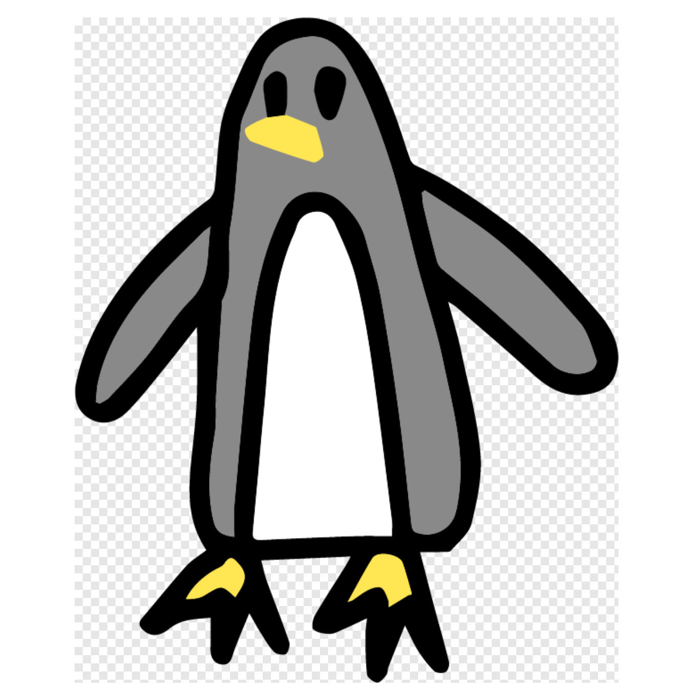
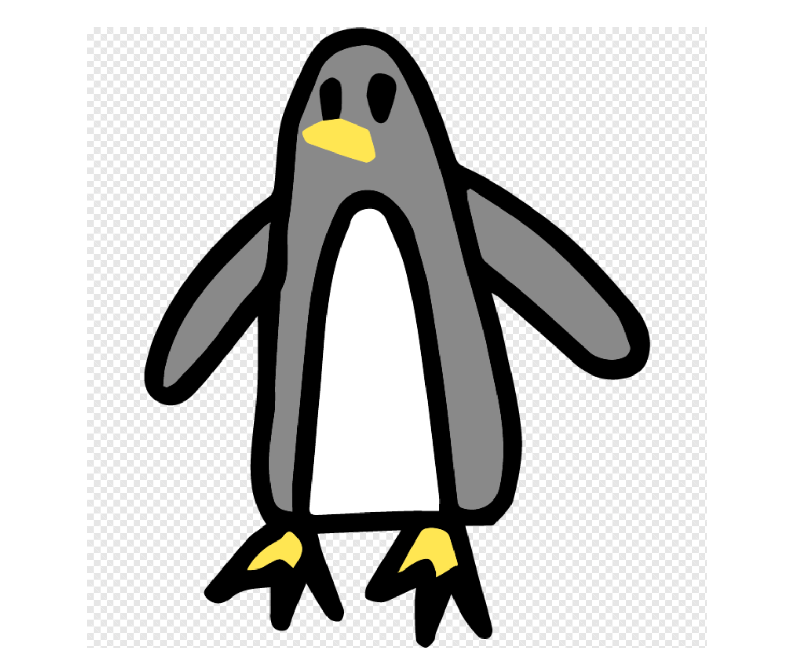

# Squarize

PNG 画像を正方形に変換するシンプルな Rust ツール。長辺に合わせて透明な正方形を作成し、元の画像をその中央に配置します。

## 機能

- 任意のサイズの画像を正方形に変換
- 透明な背景で余白を埋める
- 元の画像は中央に配置

## インストール

```bash
cargo install squarize
```

## 使い方

```bash
squarize <入力画像のパス> <出力画像のパス>
```

例：

```bash
squarize input.png output.png
```

## 実行例

### 変換前



### 変換後



## 依存ライブラリ

- image: 画像処理
- clap: コマンドライン引数の解析
